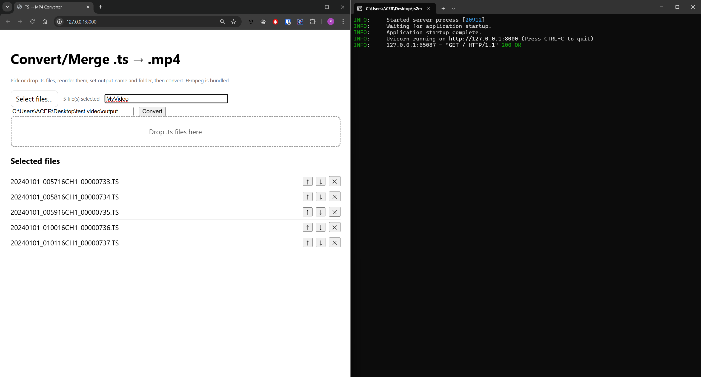

# 🎬 TS → MP4 Converter

**Single-file desktop app with FFmpeg, live progress bar, and output folder selection**

---

## 🧩 Overview

A lightweight **local web app** that merges or converts `.ts` video segments into a single `.mp4`.
Built with **FastAPI + FFmpeg**, packed into a **single executable (PyInstaller onefile)** for Windows — **no installation, no dependencies**.

The app runs locally at `http://127.0.0.1:8000` and features:
✅ Real-time **progress bar** (via Server-Sent Events)
✅ **Output folder & filename** selection
✅ **Drag-and-drop** file input with reorder controls
✅ **Bundled FFmpeg binary** for full portability

---

## 🖼️ Preview

         

---

## ⚙️ Features

* Works entirely **offline** — files stay on your computer.
* Supports multiple `.ts` files, automatically merged in order.
* Displays **live conversion progress** (time elapsed / estimated total).
* Output folder and file naming built-in.
* No overwrites: adds suffix `_1`, `_2`, etc.
* Fully English UI: custom **“Select files…”** button and **“No files selected”** message.

---

## 🏗️ Project Structure

```
ts2mp4/
├─ app_onefile_progress_fixed2.py     # FastAPI backend + embedded frontend
├─ build_onefile_windows.bat          # PyInstaller build script
├─ requirements.txt                   # Python dependencies
└─ README.md                          # This file
```

---

## 🧰 Build (Windows)

```powershell
# 1. Create a virtual environment
python -m venv .venv
.\.venv\Scripts\Activate.ps1

# 2. Install dependencies
pip install -r requirements.txt
pip install pyinstaller

# 3. Build onefile executable (FFmpeg auto-included)
.\build_onefile_windows.bat
```

After building, run:

```bash
dist\ts2mp4.exe
```

The app will open automatically in your browser.

---

## 🚀 How to Use

1. **Select or drag-drop** one or more `.ts` files.
2. **Reorder** clips using ↑ / ↓ buttons.
3. Set **output name** and **output folder**.
4. Click **Convert** — the progress bar will update in real time.
5. When done, download the merged `.mp4`.

If no folder is chosen, files are saved to `outputs/` next to the executable.

---

## 🔍 Technical Notes

* FFmpeg runs with `-progress pipe:1` to stream progress data.
* When duration is known (via ffprobe), percentage updates accurately; otherwise the bar switches to indeterminate mode.
* File concatenation uses `-f concat -safe 0` and a temporary `list.txt` written with proper LF endings and normalized paths for Windows.

---

## 🛠️ Troubleshooting

**Error “TSnfile / list.txt not found”** → fixed in this version:
the concat list is now written with real newlines (`\n`) and forward slashes.

To override the bundled FFmpeg, set:

```powershell
set FFMPEG_PATH=C:\path\to\ffmpeg.exe
```

---

## 🔒 Privacy & Local Processing

All operations are 100 % local.
Uploaded files and temporary data never leave your machine.
Temporary files are deleted automatically after conversion.

---

## 💡 Development Mode

Run directly without building:

```bash
python -m venv .venv
.\.venv\Scripts\Activate.ps1
pip install -r requirements.txt
python app_onefile_progress_fixed2.py
```

Visit [http://127.0.0.1:8000](http://127.0.0.1:8000) to test in the browser.

---

**Enjoy your offline TS → MP4 converter!** 🎥
